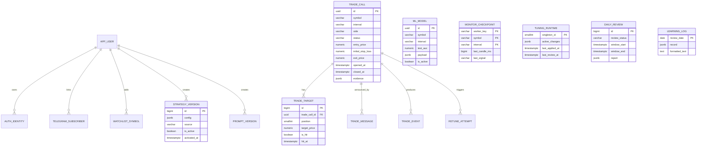

# Thiết kế PostgreSQL cho Dòng Tiền AI

## Mục tiêu

- PostgreSQL là nguồn dữ liệu runtime duy nhất.
- Một kèo chỉ có một bản ghi xuyên suốt từ lúc mở đến lúc đóng.
- Chống call trùng bằng constraint trong database, không chỉ bằng code.
- Query dashboard theo thời gian/symbol/status không phải giải nén document lớn.
- Giữ JSONB cho dữ liệu biến động mạnh: snapshot phân tích, evidence, báo cáo optimizer và cây GBDT.
- Lưu lịch sử cấu hình/model để rollback và audit được.

`public.app_documents` là lớp tương thích tạm thời. Schema đích nằm trong namespace
`trading`; code repository sẽ được chuyển từng module rồi mới xoá document store.

## Sơ đồ quan hệ

## Nhóm bảng

| Nhóm | Bảng | Vai trò |
|---|---|---|
| Danh tính | `app_user`, `auth_identity` | User nội bộ và Google/GitHub OAuth |
| Telegram | `telegram_subscriber` | Chat đang bật cảnh báo |
| Cấu hình | `strategy_version`, `prompt_version` | Version, active version và rollback |
| Model | `ml_model` | Metadata chuẩn hóa + payload GBDT JSONB |
| Giao dịch | `trade_call`, `trade_target` | Vòng đời kèo và từng TP |
| Giao tiếp | `trade_message`, `trade_event` | Telegram message và event bất biến |
| Monitor | `monitor_checkpoint` | Chống xử lý lại cùng một nến |
| Tự học | `tuning_runtime`, `retune_attempt`, `daily_review`, `daily_loss_log`, `learning_log` | Trạng thái và lịch sử optimizer |
| Quản trị | `audit_log` | Ai sửa gì, trước/sau ra sao |

## Quy tắc toàn vẹn quan trọng

1. Partial unique index `trade_call_one_open_symbol_uq` bảo đảm mỗi symbol chỉ có một kèo mở.
2. `trade_call_lifecycle` buộc kèo `open` chưa có `closed_at`, kèo đã đóng bắt buộc có.
3. `trade_call_price_direction` buộc SL long nằm dưới entry và SL short nằm trên entry.
4. `strategy_one_active_uq`, `prompt_one_active_uq` bảo đảm chỉ một cấu hình/prompt active.
5. `ml_model_one_active_pair_uq` bảo đảm mỗi `(symbol, interval)` chỉ có một model active.
6. Target có unique `(trade_call_id, position)` và `(trade_call_id, label)`.
7. Giá dùng `NUMERIC(30,12)`, không dùng `float`, để tránh sai số lưu trữ.
8. Thời điểm nghiệp vụ dùng `TIMESTAMPTZ`; millisecond của nến Binance giữ bằng `BIGINT`.

## Cái gì dùng JSONB

JSONB chỉ dùng khi schema thực sự linh hoạt hoặc payload rất lớn:

- `ml_model.payload`: toàn bộ cây GBDT và metrics chi tiết.
- `trade_call.evidence`, `analysis_snapshot`, `result_payload`.
- `retune_attempt.report`, `daily_review.report`, `learning_log.record`.
- `auth_identity.attributes` và payload event/checkpoint.

Symbol, side, status, entry, SL, thời gian, AUC và các trường cần lọc đều là cột chuẩn.

## View dashboard

`trading.v_closed_trade_performance` trả dữ liệu gọn cho biểu đồ hiệu suất, gồm
entry/exit/status, `reached_tp1` và `tp1_price`. Công thức PnL vẫn do service tính theo
strategy version để không đóng cứng một quy tắc có thể thay đổi vào SQL.

## Migration

1. `V001`: tạo `app_documents` để tương thích với code hiện tại.
2. `V002`: tạo schema chuẩn hóa, constraint, index và view.
3. `R__import_document_store`: import idempotent từ document store sang các bảng mới;
   migration này chạy lại sau mỗi lần import legacy.
4. Chuyển repository theo thứ tự: watchlist/subscriber → model/config → trade → monitor → learning.
5. Chạy đối chiếu số lượng và kết quả dashboard.
6. Chỉ xoá `app_documents` sau khi không còn code nào truy cập.

Mọi migration `V...` có checksum trong `public.schema_migrations`. Một file versioned đã chạy
không được sửa; thay đổi tiếp theo phải tạo file `V003__...sql` mới. Migration `R__...`
được phép chạy lại và bắt buộc phải idempotent.
