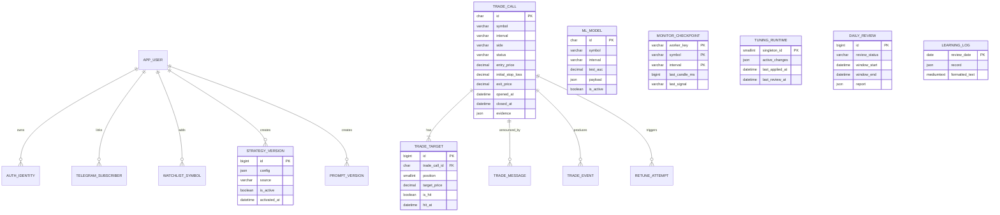

# Thiết kế TiDB/MySQL cho Dòng Tiền AI

## Mục tiêu

- TiDB Cloud là nguồn dữ liệu runtime duy nhất và được truy cập qua giao thức MySQL.
- Flyway là thành phần duy nhất tạo và nâng cấp schema.
- Một kèo có một bản ghi xuyên suốt từ lúc mở đến lúc đóng.
- Chống dữ liệu trùng bằng unique key và foreign key trong database, không chỉ bằng code.
- Các trường thường lọc trên dashboard được chuẩn hóa thành cột; payload linh hoạt dùng kiểu `JSON`.
- Lưu lịch sử cấu hình và model để có thể audit hoặc rollback.

`app_documents` là lớp tương thích cho các repository Java hiện tại. Schema chuẩn hóa đã được
tạo sẵn để từng module chuyển dần sang bảng riêng mà không phải thay database thêm lần nữa.

## Sơ đồ quan hệ

## Nhóm bảng

| Nhóm | Bảng | Vai trò |
|---|---|---|
| Tương thích | `app_documents` | Lưu document cho các repository Java chưa chuẩn hóa |
| Danh tính | `app_user`, `auth_identity` | User nội bộ và Google/GitHub OAuth |
| Telegram | `telegram_subscriber` | Chat đang bật cảnh báo |
| Watchlist | `watchlist_symbol` | Danh sách symbol và thứ tự hiển thị |
| Cấu hình | `strategy_version`, `prompt_version` | Version, active version và rollback |
| Model | `ml_model` | Metadata chuẩn hóa và payload GBDT dạng `JSON` |
| Giao dịch | `trade_call`, `trade_target` | Vòng đời kèo và từng TP |
| Giao tiếp | `trade_message`, `trade_event` | Telegram message và event bất biến |
| Monitor | `monitor_checkpoint` | Chống xử lý lại cùng một nến |
| Tự học | `tuning_runtime`, `retune_attempt`, `daily_review`, `daily_loss_log`, `learning_log` | Trạng thái và lịch sử optimizer |
| Quản trị | `audit_log` | Ai sửa gì, trước/sau ra sao |

## Quy tắc tương thích TiDB/MySQL

1. Tên bảng không kèm namespace kiểu `public` hoặc `trading`; database trong JDBC URL chính là namespace.
2. UUID được lưu bằng `CHAR(36)` và tạo bằng `UUID()`.
3. Giá dùng `DECIMAL(30,12)`, không dùng kiểu số thực, để tránh sai số lưu trữ.
4. Thời điểm nghiệp vụ dùng `DATETIME(6)` theo UTC; JDBC URL phải có `connectionTimeZone=UTC`.
5. Payload linh hoạt dùng `JSON`; ứng dụng truyền JSON hợp lệ qua MySQL Connector/J.
6. Upsert document dùng `INSERT ... ON DUPLICATE KEY UPDATE`.
7. Unique key trên generated column thay thế partial unique index: chỉ một strategy/prompt active,
   một model active cho mỗi `(symbol, interval)`, và một kèo mở cho mỗi symbol.
8. Foreign key yêu cầu TiDB 6.6 trở lên. TiDB 8.5 là lựa chọn triển khai an toàn cho schema này.
9. TiDB có thể nhận cú pháp `CHECK` nhưng chỉ thực thi khi biến
   `tidb_enable_check_constraint` được bật. Ứng dụng vẫn phải validate dữ liệu ở service layer.

## Dữ liệu JSON

`JSON` chỉ dùng khi schema thực sự linh hoạt hoặc payload lớn:

- `app_documents.document_value` trong giai đoạn tương thích.
- `ml_model.payload`: cây GBDT và metrics chi tiết.
- `trade_call.evidence`, `analysis_snapshot`, `result_payload`.
- `retune_attempt.report`, `daily_review.report`, `learning_log.record`.
- `auth_identity.attributes` và payload event/checkpoint.

Symbol, side, status, entry, stop loss, thời gian và AUC vẫn là cột chuẩn để index và query.

## View dashboard

`v_closed_trade_performance` trả dữ liệu gọn cho biểu đồ hiệu suất, gồm entry/exit/status,
`reached_tp1` và `tp1_price`. Công thức PnL vẫn do service Java tính theo strategy version để
không đóng cứng một quy tắc có thể thay đổi vào SQL.

## Migration và dữ liệu cũ

1. `V001__document_store.sql` tạo `app_documents`.
2. `V002__normalized_trading_schema.sql` tạo schema chuẩn hóa, key, index và view.
3. `R__import_document_store.sql` ghi nhận ranh giới chuyển đổi và chủ ý không chạy SQL PostgreSQL
   trên TiDB.
4. `java -jar server-java/target/dong-tien-ai.jar import-files --overwrite` nhập các file cấu hình,
   watchlist và model hiện có vào `app_documents` bằng upsert MySQL.
5. Dữ liệu từ một PostgreSQL cũ phải được export ra file trung gian rồi import bằng ứng dụng hoặc
   ETL; TiDB Cloud không thể tự đọc database cũ trong Flyway.
6. Chỉ xóa `app_documents` sau khi tất cả repository đã dùng bảng chuẩn hóa.

Flyway lưu checksum và trạng thái trong `flyway_schema_history`. Không sửa file `V...` đã phát hành;
mọi thay đổi schema tiếp theo phải dùng `V003__...sql` trở lên. File `R__...` phải luôn idempotent.
